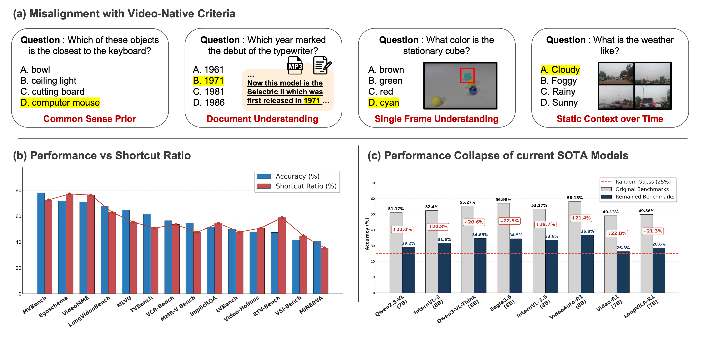

<div align="center">

# Video-Oasis: Rethinking Evaluation for Video Understanding

<p align="center">
    
<p>

</div>

<div align="center">

[](https://limgeuntaekk.github.io/Video-Oasis/)
[](https://arxiv.org/abs/2603.29616)
[](https://github.com/sejong-rcv/Video-Oasis)

</div>


> **TL;DR.** Video-Oasis rethinks the current benchmark landscape by examining whether proliferating video benchmarks truly satisfy shared criteria for genuine video understanding.


# News
- [x] Release the paper on <a href="https://arxiv.org/abs/2603.29616">arXiv</a> <br>
- [x] Release the Video-Native Challenges on <a href="https://github.com/sejong-rcv/Video-Oasis/blob/main/src/lmms_eval/video_oasis.json">link</a> <br>
- [ ] Release the code for Video-Oasis <br>

# Key Findings

<p align="center">
    
<p>

**[a] What is Genuine Video Understanding?** The inherent complexity of video understanding makes it difficult to attribute whether performance gains stem from visual perception, linguistic reasoning, or knowledge priors. While many benchmarks have emerged to assess high-level reasoning, the essential criteria that constitute video understanding remain largely overlooked.

**[b] Benchmarks solvable without complete video dependency.** To investigate this, we decouple input modalities by selectively masking visual or temporal cues to verify true spatio-temporal dependency. Then, we define the shortcut ratio as the proportion of samples solvable without complete video dependency. Strikingly, we find that 54% of existing benchmark samples can be solved without visual or temporal context.

**[c] SOTA models consistently exhibit a substantial drop when facing video-native challenges.** We dub this entire process of analyzing and filtering out shortcuts as Video-Oasis. When evaluated on our filtered, video-native challenges (non-shortcut samples), state-of-the-art (SOTA) models consistently exhibit a substantial drop, achieving performance only marginally above the random-chance level.

# 🔥 Getting Started

## 🔨 Installation

* **Requirements:** Python ≥ 3.12, CUDA-compatible GPUs, `torch`, `vllm >= 0.11.0`, `transformers >= 4.57.0`.

```bash
git clone https://github.com/sejong-rcv/Video-Oasis.git
cd Video-Oasis
pip install -e .
```

## 🎞 Dataset & Models

* We begin by curating 14 diverse benchmarks, covering tasks from perception to reasoning across durations spanning seconds to hours.

* The full list of benchmarks is available [here](https://github.com/sejong-rcv/Video-Oasis/tree/main/data/benchmarks/videos).
     * Run `python download_videos.py` within each directory to download the data.
  
* After downloading all benchmarks, run `python run_ffmpeg.py` to process and fix any corrupted or unreadable videos.
  
* Once completed, your directory structure should look like this:
~~~~
├── data/benchmarks/videos
   ├── egoschema
      └── videos
         ├── video_1
         ├── video_2
         └── ...

   ├── implicitqa
      └── videos
         ├── video_1
         ├── video_2
         └── ...

   ├── ...
 
   ├── vsi-bench
      └── videos
         ├── video_1
         ├── video_2
         └── ...
~~~~

* For model checkpoint, move to the ```data/models``` directory and run ```python download_models.py``` to download your desired models.

## 📑 Evaluation

* Evaluation is handled via [lmms-eval](https://github.com/EvolvingLMMs-Lab/lmms-eval), which is bundled within this repository.
  
* The scripts to run the benchmark suite used in our paper are located in the `src/scripts` directory.
  
* To execute the evaluation, simply set the task argument to either `vqa_total` or `v_oasis` in the script.

* An example execution script is provided below:

```bash
model_path=Video-Oasis/data/models/models/Eagle2.5-8B
output_path=./experiments/Eagle2.5-8B_16K/
master_port=$(python -c 'import socket; s=socket.socket(); s.bind(("", 0)); print(s.getsockname()[1]); s.close()')

task=vqa_total # or v_oasis

accelerate launch --num_processes=8 --main_process_port=$master_port -m lmms_eval.__main__ \
    --model eagle2_5 \
    --model_args pretrained=$model_path, \
    --tasks "$task" \
    --batch_size 1 \
    --log_samples \
    --output_path "${output_path}/"
```

##   Video-Oasis

Code coming soon! Stay tuned. (To Do List Below.)

- [ ] Tutorial for Video-Oasis (Daignostic Suite) <br>
- [ ] Tutorial for adding custom model for Video-Oasis <br>
- [ ] Tutorial for adding custom benchmark for Video-Oasis <br>

---

# Acknowledgements 👍

* Source code is built upon [VideoAuto-R1](https://github.com/IVUL-KAUST/VideoAuto-R1). 

* Evaluation is powered by [lmms-eval](https://github.com/EvolvingLMMs-Lab/lmms-eval). 

* We extend our gratitude to the creators of the following pioneering benchmarks, which laid the foundation for our work: [EgoShema](https://github.com/egoschema/EgoSchema), [ImplicitQA](https://github.com/UCF-CRCV/VRR-QA), [LongVideoBench](https://github.com/longvideobench/LongVideoBench), [LVBench](https://github.com/zai-org/LVBench), [MINERVA](https://github.com/google-deepmind/neptune?tab=readme-ov-file), [MLVU](https://github.com/JUNJIE99/MLVU), [MMR-V](https://github.com/GaryStack/MMR-V), [MVBench](https://huggingface.co/datasets/OpenGVLab/MVBench), [RTV-Bench](https://github.com/LJungang/RTV-Bench), [TVBench](https://github.com/daniel-cores/tvbench), [VCR-Bench](https://github.com/zhishuifeiqian/VCR-Bench), [Video-MME](https://github.com/MME-Benchmarks/Video-MME), [Video-Holmes](https://github.com/TencentARC/Video-Holmes), and [VSI-bench](https://github.com/vision-x-nyu/thinking-in-space). 

# Citation 🎓

If you find this work useful, please cite our paper:

```bibtex
@article{lim2026video,
  title={Video-Oasis: Rethinking Evaluation of Video Understanding},
  author={Lim, Geuntaek and Shim, Minho and Park, Sungjune and Lee, Jaeyun and Lee, Inwoong and Kim, Taeoh and Wee, Dongyoon and Choi, Yukyung},
  journal={arXiv preprint arXiv:2603.29616},
  year={2026}
}
```

# License 📄

This project is licensed under the MIT License — see the [LICENSE](LICENSE) file for details.
