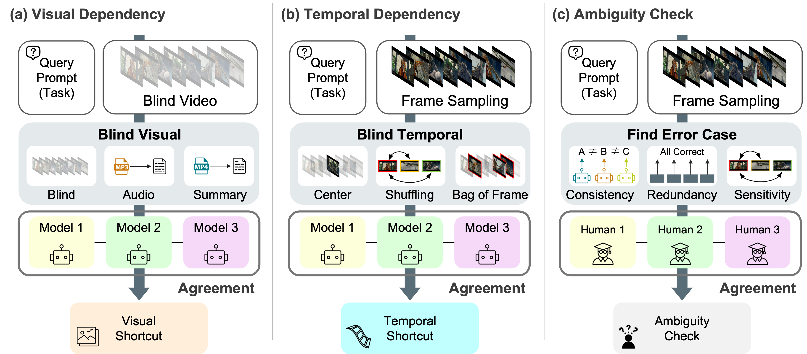

# Video-Oasis: Rethinking Evaluation for Video Understanding

    

> **TL;DR.** Video-Oasis rethinks the current benchmark landscape by examining whether proliferating video benchmarks truly satisfy shared criteria for genuine video understanding.

## Release
- [x] Release the paper on <a href="https://arxiv.org/abs/2603.29616">arXiv</a>  
- [x] Release the Video-Native Challenges on <a href="https://github.com/sejong-rcv/Video-Oasis/blob/main/src/lmms_eval/video_oasis.json">link</a>  
- [ ] Release the code for Video-Oasis  

